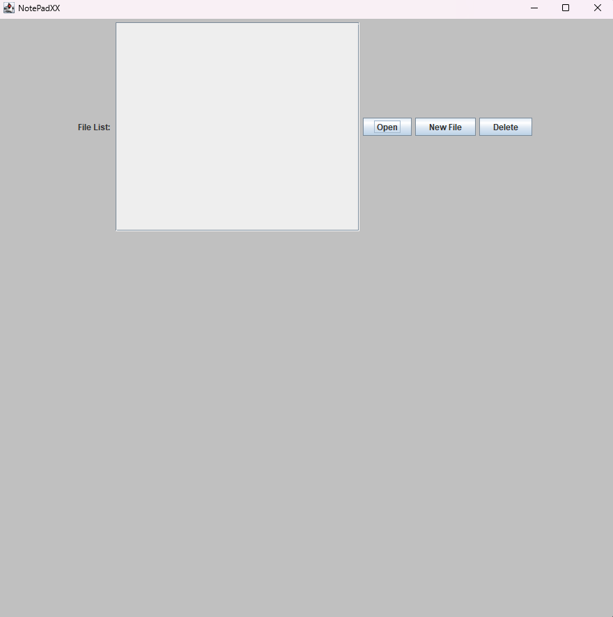
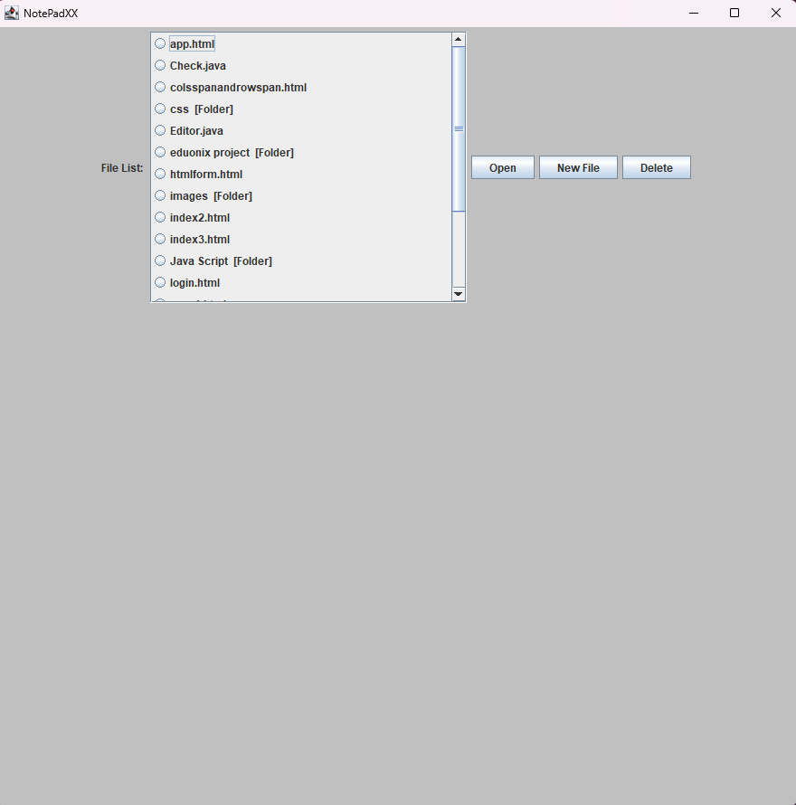
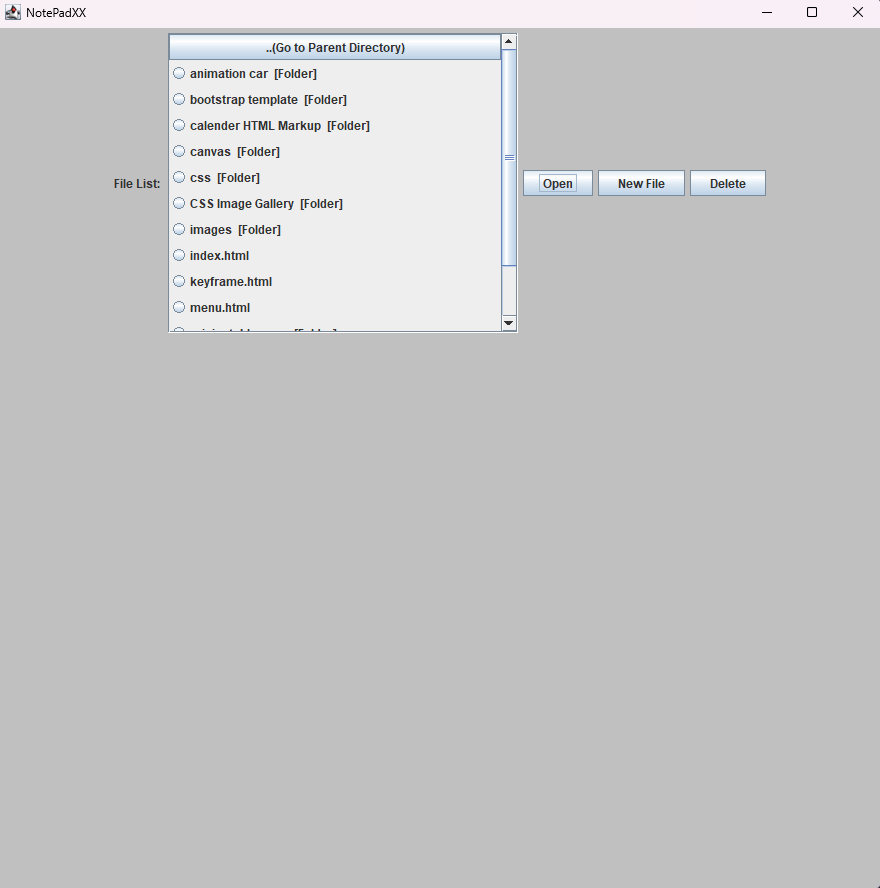
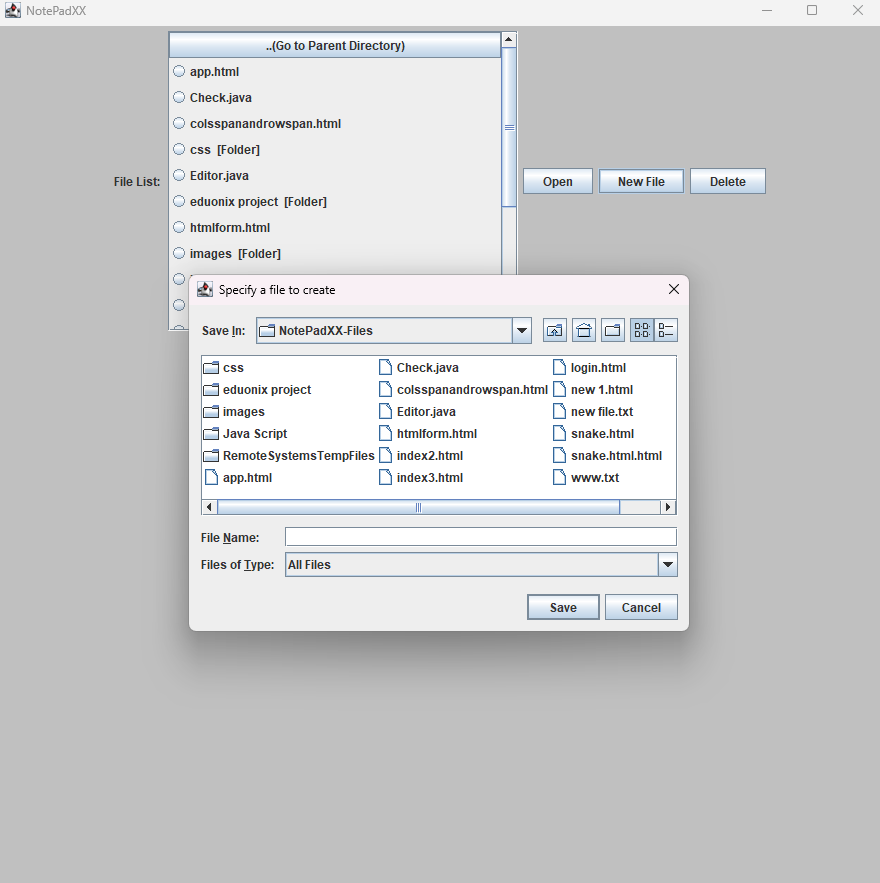
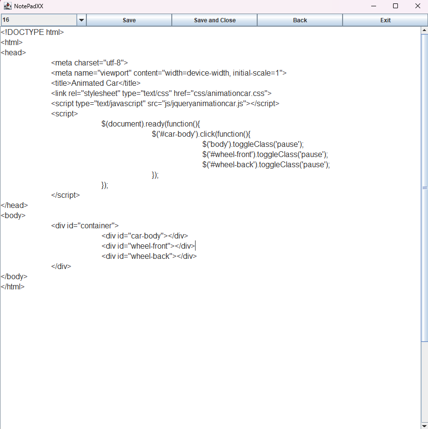

**` NotePadXX `** 
**` Text Editor `** 
**`Download the exe file and use it`** 
**`Required java latest version`** 
<h1 align="center">
 

</h1>
 
<h1 align="center">
 

</h1>
 
<h1 align="center">
 

</h1>
 
<h1 align="center">
 

</h1>
 
<h1 align="center">
 

</h1>
 
