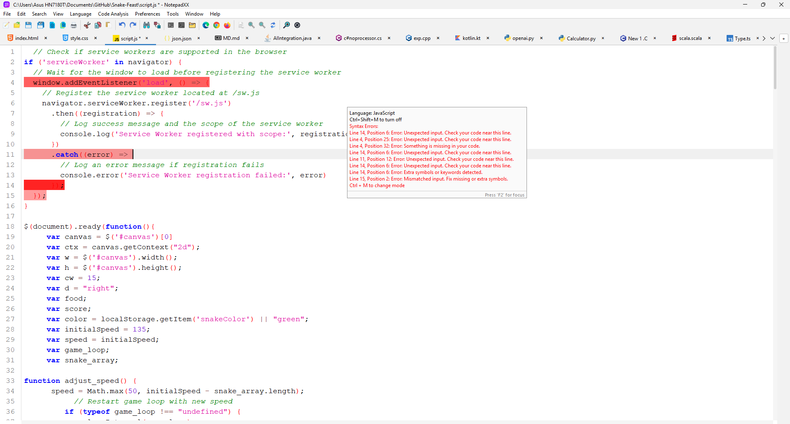
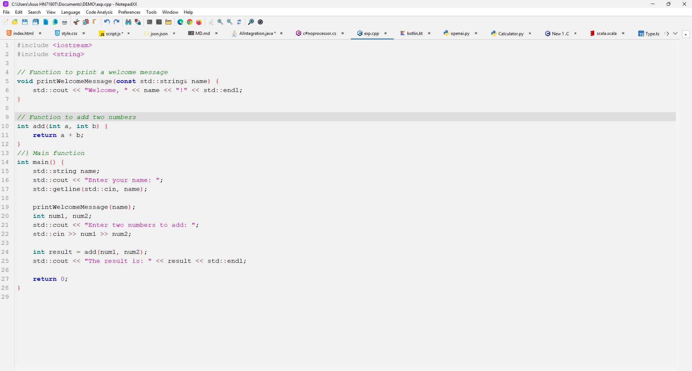
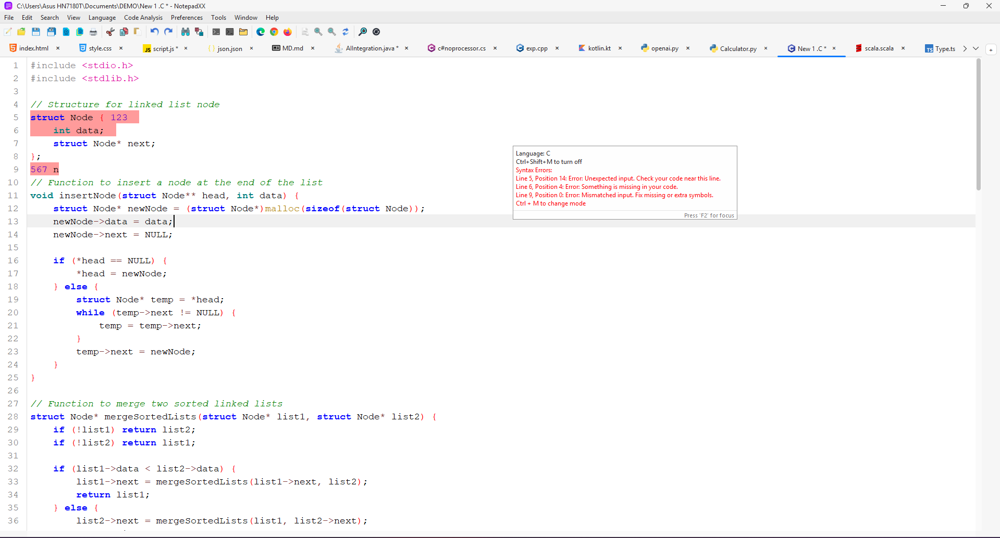

<p align="center">
 
</p>
<h1 align="center">
  NotepadXX
</h1>
<p align="center">
  NotepadXX: A Lightweight, Powerful Text Editor for Every User.
</p>
<p align="center">
  <a style="text-decoration:none" href="https://apps.microsoft.com/store/detail/9PL8NMXDXD40?cid=DevShareMCLPCS">
    
  </a>
  <a style="text-decoration:none" href="https://github.com/raghul-tech/NotepadXX/releases">
    
  </a>
  <a style="text-decoration:none">
    
  </a>
  <a style="text-decoration:none" href="https://discord.gg/MQn4GT8CVp">
    
  </a>
</p>

<p align="center">
  <a style="text-decoration:none" href="https://raghul-tech.itch.io/notepadxx">
    
  </a>
  <a style="text-decoration:none" href="https://sourceforge.net/projects/notepadxx/">
    
  </a>
  
</p>

<p align="center">
  <a href="https://buymeacoffee.com/raghultech">
    
  </a>
</p>

# NotepadXX

NotepadXX is a lightweight and user-friendly text editor application developed in Java. This hybrid app combines the strengths of **Java Swing** and **JavaFX**, offering an intuitive and responsive interface with seamless text editing and file management capabilities. The app allows users to create, edit, and format text files with ease, making it suitable for users of all skill levels.

## Features
- **File Operations**: Open, create, save, and modify text files using an intuitive file management interface.
- **Basic Editing Functions**: Supports cut, copy, paste, undo/redo, and other essential text editing operations.
- **Text Formatting**: Customize your text with font style and size options.
- **Command Line Integration**: Launch and open files directly from the command line for quick access.
- **Web Browser Opening**: Open URLs directly in your default web browser from the editor.
- **Syntax Highlighting**: Supports syntax highlighting for various programming languages (planned for future versions).
- **Multitab File Handling**: Open and edit multiple files in different tabs for better multitasking.
- **Hybrid UI**: Combines Java Swing’s reliability with JavaFX’s modern UI for a dynamic experience.
- **Real-Time File Monitoring**: Detect external file changes and prompt for reload or overwrite.
- **Customizable Themes**: Switch between light and dark modes.
- **Cross-Platform**: Compatible with any system that supports Java.
- **Lightweight and Fast**: Minimalistic design ensures quick performance.

## Screenshots
### White Themes

#### Light
<p align="center">
  <a href="https://github.com/raghul-tech/NotepadXX.git">
    
  </a>
</p>

#### Classic
<p align="center">
  <a href="https://github.com/raghul-tech/NotepadXX.git">
    
  </a>
</p>

#### macosLight
<p align="center">
  <a href="https://github.com/raghul-tech/NotepadXX.git">
    
  </a>
</p>

### Dark Themes

#### Dark
<p align="center">
  <a href="https://github.com/raghul-tech/NotepadXX.git">
    
  </a>
</p>

#### Dracula
<p align="center">
  <a href="https://github.com/raghul-tech/NotepadXX.git">
    
  </a>
</p>

#### macosDark
<p align="center">
  <a href="https://github.com/raghul-tech/NotepadXX.git">
    
  </a>
</p>

## Shortcuts:
### File Operations:
		* `Ctrl+N`: Create new tab.
		* `Ctrl+O`: Open file.
		* `Ctrl+S`: Save file.
		* `Ctrl+Alt+S`: Save as file.
		* `Ctrl+Shift+S`: Save all files.
		* `Ctrl+W`: Close tab.
		* `Ctrl+Shift+w`: Close all tab.
		* `Ctrl+Shift+T`: Restore recent closed file.
		* `Alt+F4`: Exit.
		
### Edit Operations:
		* `Ctrl+Z`: Undo.
		* `Ctrl+Y`: Redo.
		* `Ctrl+X`: Cut.
		* `Ctrl+C`: Copy.
		* `Ctrl+V`: Paste.
		* `Ctrl+P`: Print.
		
### Search Operations:
		* `Ctrl+F`: Find.
		* `Ctrl+H`: Replace.

### View Operations
		* `Ctrl+Shift+E`: File Explorer.
		* `Ctrl+Shift+C`:  Command Prompt.
		* `Ctrl+Alt+A`: Administrator Command Prompt.
		* `Ctrl+Alt+E`: Microsoft Edge.
		* `Ctrl+Shift+C`: Google Chrome.

## Tools Operations
		* `Ctrl+=`: Zoom In.
		* `Ctrl+-`: Zoom Out.
		* `Ctrl+0`: Reset Size.
## Themes

		1. **Light Theme**: A bright and clean theme for well-lit environments.
		2. **Dark Theme**: A dark and moody theme that's easy on the eyes in low light.
		3. **Classic Theme**: A traditional theme for those who prefer a timeless look.
		4. **Darcula Theme**: A dark theme with rich colors for a pleasant coding experience.
		5. **macOS Light Theme**: A light theme inspired by the macOS aesthetic.
		6. **macOS Dark Theme**: A dark theme inspired by the macOS aesthetic.

	
## Getting Started
### Prerequisites

### Installation

### From Microsoft Store
1. Visit the [Microsoft Store](https://apps.microsoft.com/detail/9pl8nmxdxd40?hl=en-in&gl=IN).
2. Click "Install" to download and use the application.

    <a href="https://apps.microsoft.com/detail/9pl8nmxdxd40?mode=direct">
	
</a>

### From itch.io
1. Go to [itch.io](https://raghul-tech.itch.io/notepadxx).
2. Download the application and follow the setup instructions.

    <a href="https://raghul-tech.itch.io/notepadxx" target="_blank" rel="noopener noreferrer">
      
    </a>

### From SourceForge
1. Navigate to [SourceForge](https://sourceforge.net/projects/notepadxx/).
2. Download the installer compatible with your operating system.

<a href="https://sourceforge.net/p/notepadxx/"></a>

[](https://sourceforge.net/projects/notepadxx/files/latest/download)

NotepadXX is available for **Windows** and **Linux**.

# How to Download and Install

## For Windows
1. **From Microsoft Store**  
   - Download the installer from the [Microsoft Store](https://apps.microsoft.com/detail/9pl8nmxdxd40?hl=en-in&gl=IN).  
   - Run the installer, and it will redirect you to the Microsoft Store to complete the installation.

2. **Using Winget**  
   - Open Command Prompt or PowerShell.  
   - Run the following command to install NotepadXX:  
     ```bash
     winget install "NotepadXX"
     ```

---

## For Linux
1. **Download the `.tar.gz` File**  
   - Visit [SourceForge](https://sourceforge.net/projects/notepadxx/) or [itch.io](https://raghul-tech.itch.io/notepadxx) and download the Linux version of the `.tar.gz` file:  
     **NotepadXXV1.1.0-Installer(Linux).tar.gz**

2. **Extract the File**  
   - Open a terminal and navigate to the directory where the `.tar.gz` file was downloaded.
   - Use the following command to extract the file:  
     ```bash
     tar -xvzf "NotepadXXV1.1.0-Installer(Linux).tar.gz"
     ```

3. **Make the Installer Executable**  
   - Navigate to the extracted folder:  
     ```bash
     cd "NotepadXXV1.1.0-Installer(Linux)"
     ```
   - Run the following command to make the `install.sh` script executable:  
     ```bash
     chmod +x install.sh
     ```

4. **Run the Installer**  
   - Execute the installer with this command:  
     ```bash
     ./install.sh
     ```
   - This will create shortcuts in your desktop and menubar for easy access.

## Changelog:

* View all official releases and downloads on the [NotepadXX Releases Page.](https://github.com/raghul-tech/NotepadXX/releases)
* For a detailed log of all changes, refer to the [CHANGELOG.md](CHANGELOG.md) file.

## Disclaimer and Privacy Statement

In the interest of complete transparency:

	- **User Privacy**: NotepadXX values your privacy. We do not and will never collect your personal information.
	- **IP Address**: Your IP address remains confidential; we do not track or log it.
	- **Typing and Files**: We do not monitor or record what you type, nor do we access any files you create, including their names and paths.
	- **Data Protection**: None of your data, including typings and files, is transmitted to us or any third parties.

#### More to read here: [[Privacy Policy](privacy-policy.md)]

## Skills Demonstrated:
	- **Java Programming**: Leveraged both Swing and JavaFX for a dynamic UI.
	- **UI/UX Design**: Focused on usability, blending classic and modern design.
	- **Tool Integration**: Implemented command execution, web browsing, and file management.
	- **Code Editor Features**: Syntax highlighting for better coding.
	- **Hybrid Development**: Merged Java Swing and JavaFX, overcoming integration challenges.
	- **Software Deployment**: Published via Microsoft Store using MSIX Packaging Tool.
	- **Performance Optimization**: Designed for fast, efficient file handling.

## Why Choose NotepadXX?
NotepadXX is not just another text editor; it’s a powerful tool designed to enhance your productivity and provide a seamless editing experience. Whether you're a coder, writer, or just someone who needs a lightweight text editor, NotepadXX offers the following benefits:

	- **Fast and Responsive**: A minimalistic design ensures quick startup times and efficient file handling without any unnecessary delays.
	- **Multitab Editing**: Manage multiple files effortlessly with our intuitive tabbed interface. No more switching between separate windows—everything is in one place.
	- **Cross-Platform Compatibility**: Works on any system that supports Java, making it accessible on various operating systems.
	- **Hybrid UI**: Combining the best of **Java Swing** and **JavaFX**, NotepadXX delivers a sleek, modern interface without sacrificing performance.
	- **Real-Time File Monitoring**: NotepadXX detects external changes to your files and alerts you, giving you full control of your workspace.
	- **Powerful Tools**: With built-in **Command Prompt** access, **Web Browser** integration, and **File Browser** capabilities, NotepadXX acts as more than just a text editor—it’s an all-in-one productivity tool.
	- **Syntax Highlighting**: Perfect for programmers, NotepadXX offers syntax highlighting for a wide range of programming languages (more to be added in future updates).
	- **Customizable Themes**: Choose between light and dark modes to match your style and enhance readability.
	- **No Bloatware**: The app is lightweight and free from unnecessary features, giving you the tools you need without the clutter.

## Why NotepadXX Stands Out:
NotepadXX isn’t just another text editor; it’s a comprehensive, feature-packed tool that combines the power of advanced coding features with essential utilities like browser access, file management, and command-line support. Perfect for developers, writers, and anyone who needs a versatile editor that can do more than just edit text.

Choose NotepadXX today and discover how it can elevate your text editing experience. **Download Now** and see the difference it makes in your workflow!

[Download Now from Microsoft Store](https://apps.microsoft.com/store/detail/9PL8NMXDXD40?cid=DevShareMCLPCS)

## Contributing

* If you like my work, please consider:
   * Star this project on GitHub
   * Leave me a review [here](https://apps.microsoft.com/store/detail/9PL8NMXDXD40?cid=DevShareMCLPCS)
   * [](https://buymeacoffee.com/raghultech)
   *  If you’re interested in contributing, please [contact me](mailto:raghultech.app@gmail.com) or submit an issue.	

## Report a Bug
   * If you've encountered a bug, please report it by clicking the link below. 
   	This will guide you through the bug-reporting process:
   	[Click here to report a bug](https://github.com/raghul-tech/NotepadXX/issues/new?template=bug_report.md)
 
## License
This project is licensed under the GNU General Public License (GPL v3).

## Contact
Email: [raghultech.app@gmail.com](mailto:raghultech.app@gmail.com)

## Stay tuned 📢:
* [NotepadXX Discord Server](https://discord.gg/MQn4GT8CVp)

