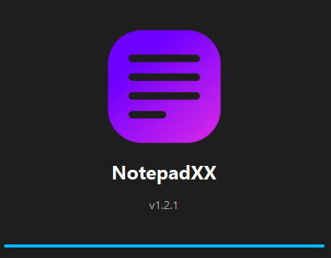
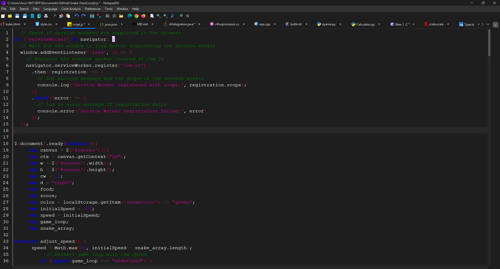

<p align="center">
 
</p>
<h1 align="center">
  NotepadXX
</h1>
<p align="center">
  NotepadXX: A Lightweight, Powerful Text Editor for Every User.
</p>
<p align="center">
  <a style="text-decoration:none" href="https://apps.microsoft.com/store/detail/9PL8NMXDXD40?cid=DevShareMCLPCS">
    
  </a>
  <a style="text-decoration:none" href="https://github.com/raghul-tech/NotepadXX/releases">
    
  </a>
  <a style="text-decoration:none">
    
  </a>
  <a style="text-decoration:none" href="https://discord.gg/MQn4GT8CVp">
    
  </a>
</p>

<p align="center">
  <a style="text-decoration:none" href="https://raghul-tech.itch.io/notepadxx">
    
  </a>
  <a style="text-decoration:none" href="https://sourceforge.net/projects/notepadxx/">
    
  </a>
  
</p>

<p align="center">
  <a href="https://buymeacoffee.com/raghultech">
    
  </a>
</p>


## ✨ About NotepadXX

NotepadXX is a powerful, modern, and cross-platform text editor built entirely in Java. Designed for both Windows and Linux, it offers a clean, responsive interface using Java Swing and JavaFX — combining speed, simplicity, and professional-grade tools.

Whether you're editing plain text, writing code, or working with Markdown, NotepadXX delivers. Enjoy features like syntax highlighting, real-time linting, Markdown preview, and smart editing — all in one lightweight, distraction-free workspace. You can even open a terminal or web browser right from the app for an efficient, uninterrupted workflow.

Developed once to run seamlessly across platforms, NotepadXX is ideal for developers, writers, and creators seeking a dependable editor without unnecessary bloat.

Try NotepadXX today and experience a smarter, faster way to edit.

---

## 🔥 Features 

- 📂 **File Operations**: Easily open, create, save, and manage text files with a user-friendly file chooser.

- ✂ **Basic Editing Functions**: Cut, copy, paste, undo/redo, and other essential editing tools included.

- 🔤 **Text Formatting**: Change font style and size to suit your preferences.

- 💻 **Command Line Integration**: Launch the app or open files directly from the terminal/command prompt.

- 🌐 **Web Browser Support**: Instantly open URLs in your default browser from within the editor.

- 🎨 **Syntax Highlighting**: Color-coded syntax support for multiple programming languages.

- 🧠 **Real-Time Linting**: Get instant feedback on your code with built-in syntax checking and analysis.

- 📝 **Markdown Preview**: View live previews of Markdown files directly inside the editor.

- 🗂️ **Multitab File Handling**: Work on multiple files at once using a tabbed interface for efficient multitasking.

- 🧩  **Hybrid UI**: Seamlessly blends Java Swing's stability with JavaFX's modern look and feel.

- 🔄 **Real-Time File Monitoring**: Automatically detect changes made to files externally and prompt to reload or overwrite.

- 🎨 **Theme Customization**: Toggle between light and dark modes to match your style.

- 🚀 **Cross-Platform Compatibility**: Runs smoothly on both Windows and Linux — one codebase, universal support.

- ⚡ **Lightweight & Fast**: Minimal UI design ensures fast load times and smooth performance.

---

## 🖼 ️Screenshots

#### Splash Screen

<p align="center">
  <a href="https://github.com/raghul-tech/NotepadXX.git">
    
  </a>
</p>

### Dark Themes

#### Dark
<p align="center">
  <a href="https://github.com/raghul-tech/NotepadXX.git">
    
  </a>
</p>

#### Darcula
<p align="center">
  <a href="https://github.com/raghul-tech/NotepadXX.git">
    
  </a>
</p>

#### macosDark
<p align="center">
  <a href="https://github.com/raghul-tech/NotepadXX.git">
    
  </a>
</p>


### White Themes

#### Light
<p align="center">
  <a href="https://github.com/raghul-tech/NotepadXX.git">
    
  </a>
</p>

#### Classic
<p align="center">
  <a href="https://github.com/raghul-tech/NotepadXX.git">
    
  </a>
</p>

#### macosLight
<p align="center">
  <a href="https://github.com/raghul-tech/NotepadXX.git">
    
  </a>
</p>

#### MarkDown Preview
* preview can be viewed by `Ctrl+K` to open in a  new tab or `Ctrl+Shift+K` to open in a new window 
<p align="center">
  <a href="https://github.com/raghul-tech/NotepadXX.git">
    
  </a>
</p>


---

## ⌨  Keyboard Shortcuts:
### File Operations:
* `Ctrl+N`: Create new tab.
* `Ctrl+O`: Open file.
* `Ctrl+S`: Save file.
* `Ctrl+Alt+S`: Save as file.
* `Ctrl+Shift+S`: Save all files.
* `Ctrl+W`: Close tab.
* `Ctrl+Shift+w`: Close all tab.
* `Ctrl+Shift+T`: Restore recent closed file.
* `Alt+F4`: Exit.
		
### Edit Operations:
* `Ctrl+Z`: Undo.
* `Ctrl+Y`: Redo.
* `Ctrl+X`: Cut.
* `Ctrl+C`: Copy.
* `Ctrl+V`: Paste.
* `Ctrl+P`: Print.
		
### Search Operations:
* `Ctrl+F`: Find.
* `Ctrl+H`: Replace.

### View Operations
* `Ctrl+Shift+E`: File Explorer.
* `Ctrl+Shift+C`:  Command Prompt.
* `Ctrl+Alt+A`: Administrator Command Prompt.
* `Ctrl+Alt+E`: Microsoft Edge.
* `Ctrl+Alt+C`: Google Chrome.
* `Ctrl+Alt+F`: Fire Fox.

### Tools Operations
 * `Ctrl+=`: Zoom In.
 * `Ctrl+-`: Zoom Out.
 * `Ctrl+0`: Reset Size.
	
### Markdown Preview Operations
* `Ctrl+K`:Open preview in a tab
* `Ctrl+Shift+K`:Open preview in a new Window

### Tab Change Operations
* `Ctrl+→ / Ctrl+←`:Switch to the next/previous tab (focus between tabs)
* `Ctrl+Shift+→ / Ctrl+Shift+←`:Move the current tab to the right/left

### ToolTip Operations
* `Ctrl+M`:Toggle tooltip for code errors
* `Ctrl+Shift+M`:Hide code error tooltips

---		
		
## 🎨 Themes

1. **Light Theme**: A bright and clean theme for well-lit environments.
2. **Dark Theme**: A dark and moody theme that's easy on the eyes in low light.
3. **Classic Theme**: A traditional theme for those who prefer a timeless look.
4. **Darcula Theme**: A dark theme with rich colors for a pleasant coding experience.
5. **macOS Light Theme**: A light theme inspired by the macOS aesthetic.
6. **macOS Dark Theme**: A dark theme inspired by the macOS aesthetic.

---
	
## 🚀 Getting Started
### ✅ Prerequisites

### 📥 Installation

###  Microsoft Store (Recommended – Windows)
1. Visit the [Microsoft Store](https://apps.microsoft.com/detail/9pl8nmxdxd40?hl=en-in&gl=IN).
2. Click "Install" to download and use the application.

    <a href="https://apps.microsoft.com/detail/9pl8nmxdxd40?mode=direct">
	
</a>

###  itch.io
1. Go to [itch.io](https://raghul-tech.itch.io/notepadxx).
2. Download the application and follow the setup instructions.

    <a href="https://raghul-tech.itch.io/notepadxx" target="_blank" rel="noopener noreferrer">
      
    </a>

1. Navigate to [SourceForge](https://sourceforge.net/projects/notepadxx/).
2. Download the installer compatible with your operating system.

<a href="https://sourceforge.net/p/notepadxx/"></a>

[](https://sourceforge.net/projects/notepadxx/files/latest/download)

NotepadXX is available for **Windows** and **Linux**.

---
 
#  🧰 Installation Instructions 

## 🪟 Windows Installation
1. **Microsoft Store**  
   - Download the installer from the [Microsoft Store](https://apps.microsoft.com/detail/9pl8nmxdxd40?hl=en-in&gl=IN).  
   - Run the installer, and it will redirect you to the Microsoft Store to complete the installation.

2. **Winget (Windows Package Manager)**  
   - Open Command Prompt or PowerShell.  
   - Run the following command to install NotepadXX:  
     ```bash
     winget install "NotepadXX"
     ```

---

##  🐧 Linux Installation
1. **Download the `.tar.gz` File**  
   - Visit [SourceForge](https://sourceforge.net/projects/notepadxx/) or [itch.io](https://raghul-tech.itch.io/notepadxx) and download the Linux version of the `.tar.gz` file:  
     **NotepadXXV1.2.0-Installer(Linux).tar.gz**

2. **Extract the File**  
   - Open a terminal and navigate to the directory where the `.tar.gz` file was downloaded.
   - Use the following command to extract the file:  
     ```bash
     tar -xvzf "NotepadXXV1.2.0-Installer(Linux).tar.gz"
     ```

3. **Make the Installer Executable**  
   - Navigate to the extracted folder:  
     ```bash
     cd "NotepadXXV1.2.0-Installer(Linux)"
     ```
   - Run the following command to make the `install.sh` script executable:  
     ```bash
     chmod +x install.sh
     ```

4. **Run the Installer**  
   - Execute the installer with this command:  
     ```bash
     ./install.sh
     ```
   - This will create shortcuts in your desktop and menubar for easy access.

---

## 🆕 Changelog:

* View all official releases and downloads on the [NotepadXX Releases Page.](https://github.com/raghul-tech/NotepadXX/releases)
* For a detailed log of all changes, refer to the [CHANGELOG.md](CHANGELOG.md) file.

---

## 🔒 Disclaimer and Privacy Statement

In the interest of complete transparency:

- **User Privacy**: NotepadXX values your privacy. We do not and will never collect your personal information.
- **IP Address**: Your IP address remains confidential; we do not track or log it.
- **Typing and Files**: We do not monitor or record what you type, nor do we access any files you create, including their names and paths.
- **Data Protection**: None of your data, including typings and files, is transmitted to us or any third parties.

#### 📖 More to read here: [[Privacy Policy](privacy-policy.md)]

---

## 🧠 Skills Demonstrated

- **Java Programming**: Built using both **Swing** and **JavaFX** to deliver a responsive and feature-rich experience.
- **UI/UX Design**: Clean, minimal, and user-centered interface for ease of use and visual clarity.
- **Tool Integration**: Bundled with built-in **File Browser**, **Web Browser**, and **Command Terminal**—no need to switch apps.
- **Code Editor Features**: Syntax highlighting, intelligent indentation, and auto-completion.
- **GoodKill Feature**: A unique smart error detection system—if a user types an incorrect line of code (like missing a semicolon), the editor immediately highlights the area in **red** and shows an informative **tooltip** using **ANTLR-based lexer and parser** for real-time analysis.
- **Hybrid Development**: Combines the robustness of Java Swing with the modern UI capabilities of JavaFX.
- **Deployment**: Seamlessly packaged using **MSIX** and made available on the **Microsoft Store**.
- **Optimization**: Built for speed and efficiency, with minimal memory footprint and instant load times.

---

## 🔍 Code Analysis & Quality

NotepadXX is built with clean code practices and robust analysis mechanisms to ensure a top-tier development experience:

- **ANTLR-Powered Code Intelligence**: Uses **ANTLR lexer and parser** to parse and validate code in real-time. Syntax errors such as missing semicolons or invalid tokens are:
  - **Highlighted in red**
  - **Accompanied by tooltips** explaining the issue
- **Static Code Analysis**: Utilizes tools like **PMD**, **Checkstyle**, and **SpotBugs** to enforce best practices and prevent code smells.
- **Error Handling**: Comprehensive exception management ensures smooth and crash-free usage, even in edge cases.
- **Performance Profiling**: Memory usage and responsiveness are continuously monitored and optimized.
- **Thread Management**: Critical processes such as file I/O, theme switching, and large file operations run on separate threads for a seamless experience.
- **Refactoring Culture**: The codebase is regularly improved for simplicity, maintainability, and future scalability.
- Users can toggle between normal and advanced error tooltips using `Ctrl + M`.
- Use `Ctrl + Shift + M` to toggle tooltip visibility.

> NotepadXX isn’t just powerful—it’s intelligent, fast, and built with precision.

---

## 🌟 Why Choose NotepadXX?
NotepadXX is not just another text editor; it’s a powerful tool designed to enhance your productivity and provide a seamless editing experience. Whether you're a coder, writer, or just someone who needs a lightweight text editor, NotepadXX offers the following benefits:

- 🚀 **Fast and Responsive**: A minimalistic design ensures quick startup times and efficient file handling without any unnecessary delays.
- 🧩 **Multitab Editing**: Manage multiple files effortlessly with our intuitive tabbed interface. No more switching between separate windows—everything is in one place.
- 🌐 **Cross-Platform Compatibility**: Works on any system that supports Java, making it accessible on various operating systems.
- 💡 **Hybrid UI**: Combining the best of **Java Swing** and **JavaFX**, NotepadXX delivers a sleek, modern interface without sacrificing performance.
- 🔄 **Real-Time File Monitoring**: NotepadXX detects external changes to your files and alerts you, giving you full control of your workspace.
- 🛠️ **Productivity Tools**: With built-in **Command Prompt** access, **Web Browser** integration, and **File Browser** capabilities, NotepadXX acts as more than just a text editor—it’s an all-in-one productivity tool.
- 💻 **Syntax Highlighting**: Perfect for programmers, NotepadXX offers syntax highlighting for a wide range of programming languages (more to be added in future updates).
- 🎨 **Customizable Themes**: Choose between light and dark modes to match your style and enhance readability.
- ❌ **No Bloatware**: The app is lightweight and free from unnecessary features, giving you the tools you need without the clutter.

---

## 🆚 Why NotepadXX Stands Out

**NotepadXX** isn’t just another text editor — it’s a powerful, modern tool built for productivity.

Whether you’re a developer, student, or content creator, NotepadXX helps you get more done with features like:

- 🧠 **Smart Code Editing** – Syntax highlighting, custom themes, and keyboard shortcuts  
- 🌐 **Built-in Browser Access** – Preview web pages and content without switching tabs  
- 🗂️ **Integrated File Manager** – Quickly navigate and manage your files within the editor  
- 💻 **Terminal Access** – Run command-line tools right from inside the app  
- 🌓 **Dark & Light Themes** – Choose the look that suits your style  

**Built with Java 23 & JavaFX**, NotepadXX runs smoothly across Windows and Linux with a native feel and modern UI.

> ⚡ Designed for speed, built for productivity.

---

💡 **Experience the power of an all-in-one editor. Install NotepadXX from the Microsoft Store and upgrade your workflow today.**

---

## 🤝 Contributing

* If you like my work, please consider:
   * ⭐ Star this project on GitHub
   * 💬  Leave me a review [here](https://apps.microsoft.com/store/detail/9PL8NMXDXD40?cid=DevShareMCLPCS)
   * ☕ [](https://buymeacoffee.com/raghultech)
   * 📩 Interested in contributing? [Email Me](mailto:raghultech.app@gmail.com)	
   * Check out the [CONTRIBUTING.md](CONTRIBUTING.md) to get started.

---

## 🐞 Report a Bug
   * If you've encountered a bug, please report it by clicking the link below. 
   	This will guide you through the bug-reporting process:
   	➡️ [Click here to report a bug](https://github.com/raghul-tech/NotepadXX/issues/new?template=bug_report.md)
 
 ---
 
## 🧾 License
This project is licensed under the [GNU General Public License (GPL v3)](LICENSE).

---

## 📬 Contact
Email: [raghultech.app@gmail.com](mailto:raghultech.app@gmail.com)

---

## 📢 Stay Tuned :
* 🎧 [Join the NotepadXX Discord Server](https://discord.gg/MQn4GT8CVp) for support, updates, and community discussions.

